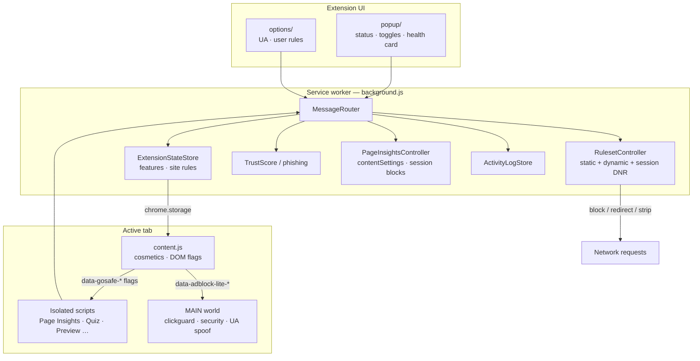
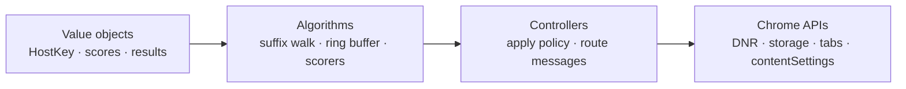
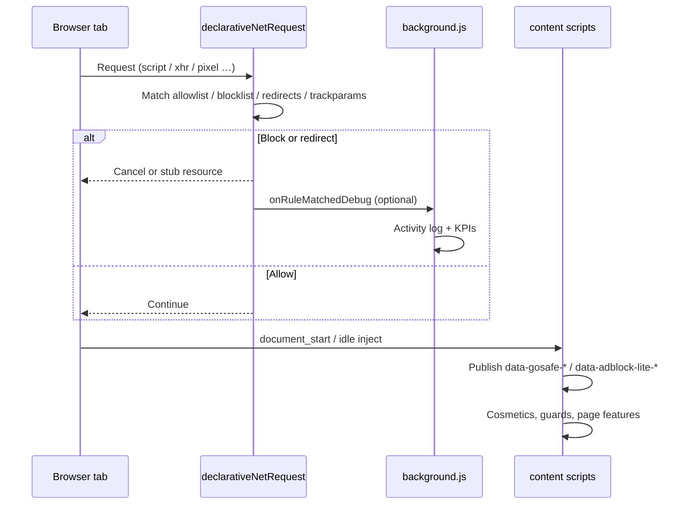
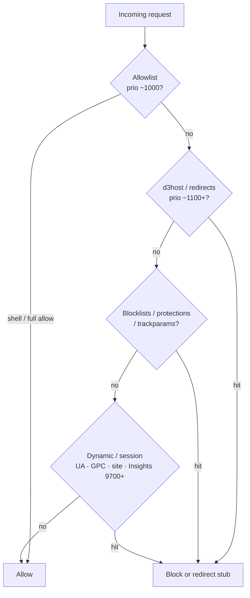
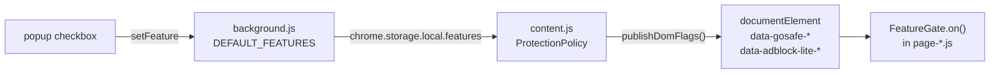
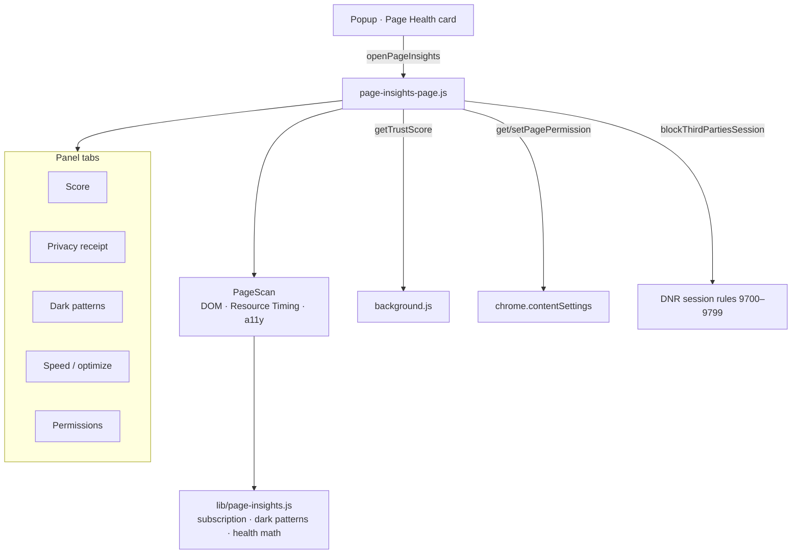
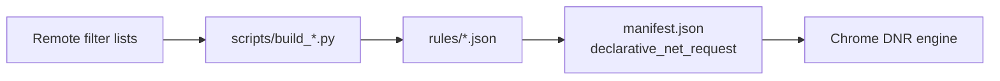

# GOSAFE adblock

**Chrome Manifest V3** extension for tracker / ad / phishing defense — plus page helpers for privacy, media, learning tools, and Page Insights.

| | |
|---|---|
| **Version** | `1.27.0` |
| **Platform** | Chromium (Chrome / Edge / Brave) |
| **Engine** | `declarativeNetRequest` + isolated / MAIN-world content scripts |
| **Repo** | [CRayuth/GOSAFE-extension](https://github.com/CRayuth/GOSAFE-extension) |

---

## Table of contents

1. [Features](#features)
2. [Architecture](#architecture)
3. [Request & protection flow](#request--protection-flow)
4. [Feature-flag pipeline](#feature-flag-pipeline)
5. [Page Insights](#page-insights)
6. [Install](#install)
7. [Rulesets & build](#rulesets--build)
8. [Project layout](#project-layout)
9. [Development notes](#development-notes)

---

## Features

| Area | What it does |
|------|----------------|
| **Network** | Block / redirect trackers via DNR; strip tracking params; HTTPS upgrade; DNS defense |
| **Privacy** | WebRTC shield, fingerprint noise, random UA, GPC/DNT, cookie-consent reject, clipboard crypto guard |
| **Security** | Phishing / trust score, permission spam guard, malware host feeds, security watch |
| **Page UX** | Force English, link preview, text selection + QCM (NVIDIA), reader mode, video PiP |
| **Site helpers** | YouTube / Spotify ad skip, Medium unlock, login-wall peek, Facebook Add Friend |
| **Quiz Assist** | Kahoot bank + NVIDIA answers (Quizizz / Wayground / Kahoot) |
| **Page Insights** | Privacy receipt, subscription / dark-pattern detectors, session perf block, permissions, health score |
| **Control** | Popup toggles, per-site Auto / Whitelist / Block, hide-element picker, user rules, activity log |

GOSAFE is **not** a fork of uBlock Origin. It reuses community filter lists and implements its own MV3 stack.

---

## Architecture

High-level composition: the **service worker** owns network policy and messages; **content scripts** apply page behavior; the **popup** is the control surface.



### OOP style

Each script is a small composition of **value objects**, **catalogs**, **algorithms**, and a **controller** entry (e.g. `ContentController`, `MessageRouter`).



---

## Request & protection flow

What happens when a page loads and a subresource is requested:



### DNR priority (simplified)



---

## Feature-flag pipeline

Features are camelCase booleans mirrored in **three** places, then published as DOM attributes for page scripts.



| Flag example | DOM attribute | Script |
|--------------|---------------|--------|
| `pageInsights` | `data-gosafe-page-insights` | `page-insights-page.js` |
| `quizAssist` | `data-gosafe-quiz-assist` | `quiz-assist-page.js` |
| `permissionGuard` | `data-adblock-lite-permissions` | `security-page.js` (MAIN) |

Master kill: `data-adblock-lite="off"` (protection paused / disabled).

---

## Page Insights

On-demand panel (no floating button). Open from the popup **Page Health** card; close with **✕** or **Esc**.



**Health score pillars (weights):** Speed 25 · Privacy 25 · Security 30 · Accessibility 20.

---

## Install

1. Open `chrome://extensions`
2. Enable **Developer mode**
3. **Load unpacked** → select this repository folder
4. Reload the extension after code or ruleset rebuilds

Approve new permissions when prompted (e.g. `contentSettings` for Page Insights permission manager).

---

## Rulesets & build

### Filter sources (lite default)

- [HaGeZi](https://github.com/hagezi/dns-blocklists) Pro Mini, TIF Mini, Fake, Pop-Up Ads  
- [EasyList](https://easylist.to/) / EasyPrivacy / Fanboy Cookie  
- [uBlock uAssets](https://github.com/uBlockOrigin/uAssets) filters, badware, privacy, quick-fixes, unbreak  
- [Peter Lowe](https://pgl.yoyo.org/adservers/) · [URLhaus](https://gitlab.com/malware-filter/urlhaus-filter)  
- AdGuard Tracking Protection (in blocklist build) · URL Tracking → `rules/trackparams.json`



### Common commands

```bash
# Blocklists
python scripts/build_blocklists.py --lite
python scripts/build_blocklists.py --full          # larger; more memory

# Specialized rulesets
python scripts/build_d3host.py
python scripts/build_redirects.py
python scripts/build_trackparams.py
python scripts/refresh_rulesets.py                 # d3host + redirects
python scripts/refresh_rulesets.py --lite

# PhishTrap local signals
pip install datasets
python scripts/build_phishtrap_signals.py

# Chrome Web Store zip
python scripts/pack_store.py                       # → dist/gosafe-adblock.zip
```

GitHub Actions: `.github/workflows/refresh-rulesets.yml` (daily + manual).

### Allowlist model

| Mode | Priority | Behavior |
|------|----------|----------|
| **Full allow** | ~1000 | Streaming, YouTube media, CDNs, fonts, Spotify, Canva, Medium |
| **Shell allow** | ~900 | Major sites for `main_frame` / `sub_frame` only — tracker subdomains still blockable |
| **d3host / redirects** | ~1100+ | Win over broad allow for known tracker hosts |

Build-time `is_allowlisted()` skips tracker-shaped hosts (`ads.*`, `analytics.*`, `pixel.*`, …).

---

## Project layout

```text
GOSAFE-extension/
├── background.js          # Service worker · MessageRouter · DNR · privacy
├── content.js             # Cosmetics · ProtectionPolicy · DOM flags
├── page-insights-page.js  # Page Insights UI (on demand)
├── quiz-assist-page.js    # Quiz Assist
├── security-page.js       # MAIN · clipboard / permissions / scriptlets
├── clickguard-page.js     # MAIN · overlay / open / hijack guards
├── popup/                 # Control UI
├── options/               # UA + user rules pages
├── lib/                   # Shared modules (phishing, activity log, page-insights, …)
├── rules/                 # Compiled DNR JSON
├── scripts/               # Python ruleset builders
└── web-accessible-resources/redirects/   # Empty stubs for $redirect-style neuter
```

### Core modules (`lib/`)

| Module | Role |
|--------|------|
| `ds.js` | `HostKey`, edit distance, LRU cache |
| `phishing.js` | Risk scorer, navigation guard, TrustScore |
| `page-insights.js` | Subscription / dark-pattern regexes, health score math |
| `site-rules.js` | Per-host allow/block → dynamic DNR |
| `activity-log.js` | Ring buffer + KPIs for the popup |
| `list-updater.js` | Supplemental list sync |
| `dns-defense.js` | DNS-layer defense engine |
| `ai-nvidia.js` | NVIDIA chat helpers (Quiz / QCM) |

---

## Development notes

### User rules

Popup → **Rules**, or `options/user-rules.html`:

```text
||tracker.example^
example.com##.ad-rail
##.cookie-banner
```

Network lines → dynamic DNR (ids `9600+`). Cosmetic lines merge with hide-element / adaptive cosmetics.

### Compatibility caveats

- YouTube / Spotify ads are largely first-party — handled by page hooks, not raw host blocks on player APIs  
- Do not block Spotify `spclient` / pathfinder (breaks playback)  
- Peek-without-login only dismisses walls when content is already in the DOM  
- Cosmetic exceptions / full EasyList scriptlets are not fully supported  
- HTTPS upgrade can break rare HTTP-only LAN devices — toggle off if needed  
- Random UA rewrites the HTTP header (DNR) and in-page `navigator` / Client Hints  

### Patterns

- **Message dispatch** — `Map` of `message.type` → handler in `MessageRouter`  
- **Feature gating** — missing `data-gosafe-*` attribute counts as **on** (race-safe with `content.js`)  
- **Session Insights blocks** — DNR rule ids `9700–9799`, opt-in only  

---

## License / credits

Filter lists belong to their respective authors (HaGeZi, EasyList, uBlock uAssets, AdGuard, etc.).  
PhishTrap signal thresholds distilled from [saidutta69/PhishTrap](https://huggingface.co/datasets/saidutta69/PhishTrap).  
UA options inspired by [random-user-agent](https://github.com/tarampampam/random-user-agent).
